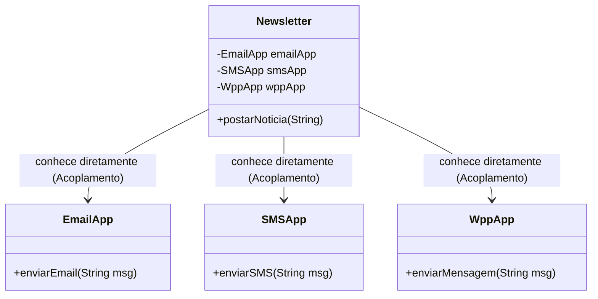

# Diagramas UML: Padrão Observer (Newsletter)

Este documento contém a representação visual das duas abordagens implementadas na pasta `observer/`.

## 1. Abordagem com Padrão (Observer - Desacoplado)

A `Newsletter` mantém uma lista de interessados (`Observer`). Ela não sabe se o inscrito é um app de Email, SMS ou WhatsApp, apenas que todos eles possuem o método `update`.

```mermaid
classDiagram
    class Newsletter {
        -List~Observer~ inscritos
        +adicionarInscrito(Observer)
        +removerInscrito(Observer)
        +postarNoticia(String)
    }
    
    class Observer {
        <<interface>>
        +update(String mensagem)
    }
    
    class EmailApp {
        +update(String mensagem)
    }
    
    class SMSApp {
        +update(String mensagem)
    }

    clas WppApp {
        +update(String mensagem)
    }

    Newsletter o-- Observer : agrega (Observa)
    Observer <|.. EmailApp : implementa
    Observer <|.. SMSApp : implementa
    Observer <|.. WppApp: implementa
```

---

## 2. Abordagem Anti-Padrão (Acoplamento Forte)

Neste modelo, a `Newsletter` cria e gerencia instâncias específicas de `EmailApp` e `SMSApp`. Se quisermos adicionar um novo meio de comunicação, precisamos alterar o código interno da `Newsletter`.


