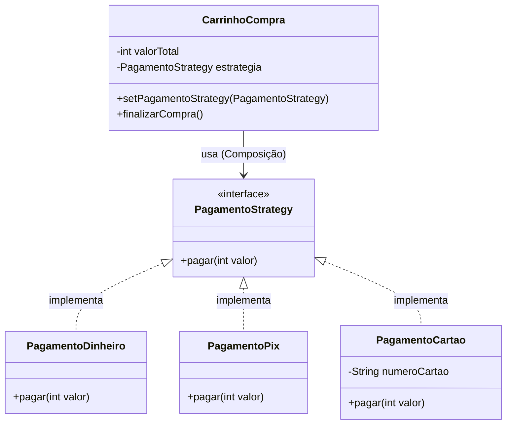
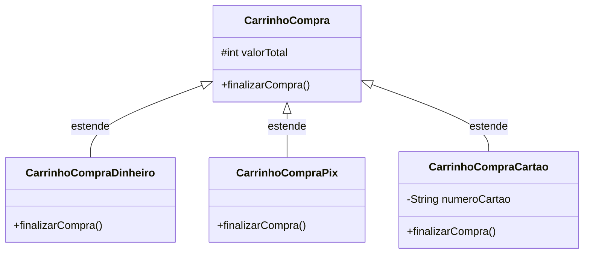

# Diagramas UML: Padrão Strategy (Sistema de Pagamento)

Este documento contém a representação visual das duas abordagens implementadas na pasta `strategy/`.

## 1. Abordagem com Padrão (Uso de Interface e Composição)

Nesta abordagem, o `CarrinhoCompra` não sabe como o pagamento é processado. Ele apenas chama o método `pagar` de uma interface. Isso permite trocar a forma de pagamento em tempo de execução.

---

## 2. Abordagem Anti-Padrão (Uso de Herança)

Nesta abordagem, o comportamento de pagamento está "travado" no tipo do objeto. Para mudar de Pix para Cartão, você teria que criar um novo objeto e transferir os dados, em vez de apenas trocar um atributo.

